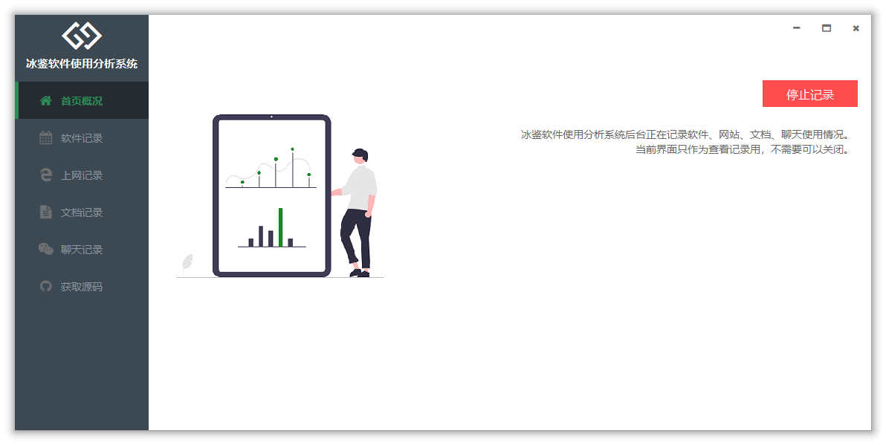
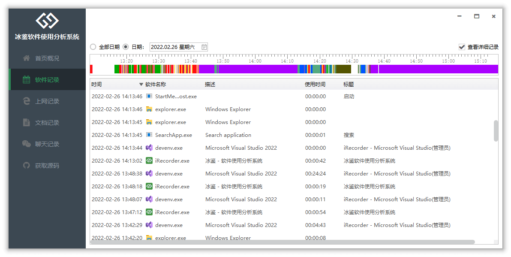
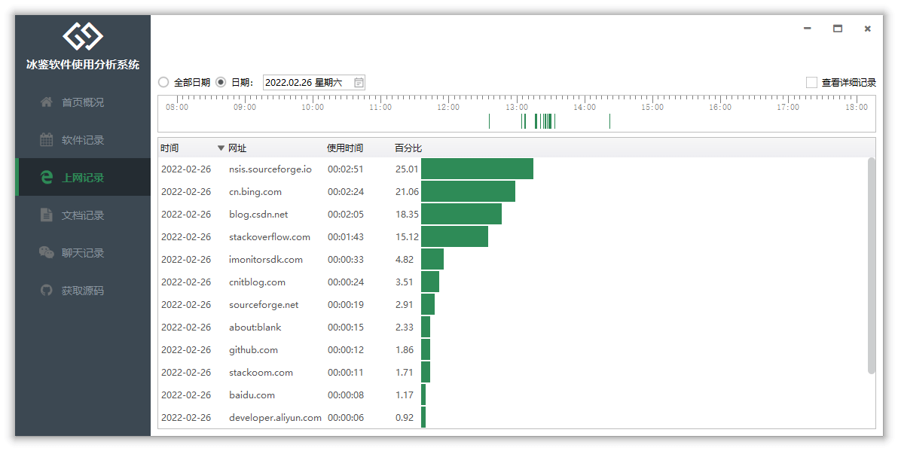

## iRecorder

**冰鉴 - 软件使用分析系统** 【上班不摸鱼】 是一款为个人打造、专门分析自己电脑使用情况的软件。

## 功能介绍

使用本软件可以记录每个软件的使用情况，也可以记录每天的上网情况。通过记录分析可以知道自己一天都做了什么，是否摸鱼混日子。

随着远程办公的普及，作为企业负责人，如果您想了解公司每个员工的工作情况，分析员工的工作效率，可以试用：**[冰云 - 终端一体化管理平台](https://imonitorsdk.com/icms)**

## 功能特点

- 记录的是每个软件是实际操作时间，而不是进程的运行时间。
- 记录的是通过浏览器上网的地址，而不是其他途径访问的网络。
- 可以记录每个软件的使用切换好像，分析工作是否频繁被打断。

## 软件截图

因特殊原因，源码强制回滚，已经Fork的请不要更新。软件提供二进制更新。
