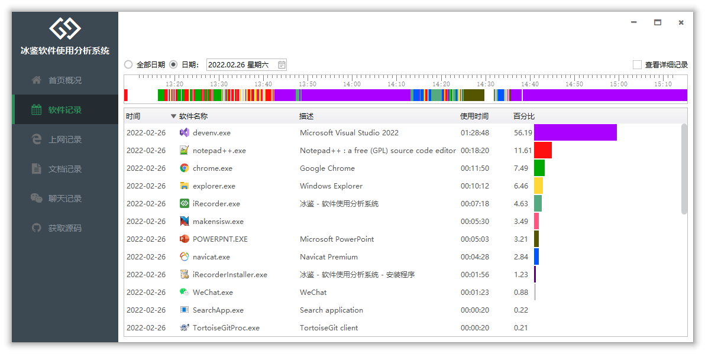

## iRecorder

**冰鉴 - 软件使用分析系统** 【上班不摸鱼】 是一款为个人打造、专门分析自己电脑使用情况的软件。

## 功能介绍

使用本软件可以记录每个软件的使用情况，也可以记录每天的上网情况。通过记录分析可以知道自己一天都做了什么，是否摸鱼混日子。

随着远程办公的普及，作为企业负责人，如果您想了解公司每个员工的工作情况，分析员工的工作效率，可以试用：**[冰云 - 终端一体化管理平台](https://imonitorsdk.com/icms)**

## 功能特点

- 记录的是每个软件是实际操作时间，而不是进程的运行时间。
- 记录的是通过浏览器上网的地址，而不是其他途径访问的网络。
- 可以记录每个软件的使用切换好像，分析工作是否频繁被打断。
- **可以分析统计正在操作的Office文档路径**
- **可以分析统计正在聊天的用户**

## 源码获取

最新版本源码只提供给购买了 [iRecorderSDK](https://github.com/wecooperate/iRecorderSDK) 的客户。

在新版本发布后，会定期开源旧版本源码。

## 软件截图

## 版本说明

## 1.0.2.0

- 添加时间线功能，可以直观看到软件切换过程
- 添加百分比条，可以直观看到使用占比
- 添加文档使用对应的路径
- 添加微信聊天对象

## 1.0.1.0

初始化版本

## [关于我们](https://imonitorsdk.com/about)
